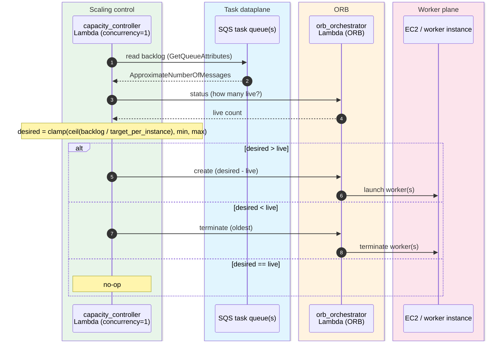
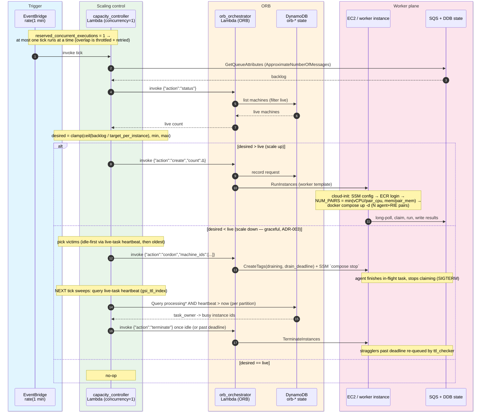

# HTC-Grid EC2 Backend — Scaling Sequence

The control loop for `worker_backend = "ec2"`: every `rate(1 minute)` the capacity
controller reconciles demand (SQS backlog) against supply (ORB live machine count) and
drives ORB to create/terminate worker instances. This is the EC2 analogue of KEDA +
Cluster Autoscaler on the EKS backend.

## High-level (the core loop)

The essential decision loop: read backlog, read live capacity, reconcile, create or
terminate workers.

## Detailed

Same loop with the trigger, ORB state store, worker boot, and task dataplane shown.

## Notes

- **Backlog read directly from SQS (no CloudWatch hop).** The controller reads the demand
  signal straight from the task queue — `queue_manager(...).get_queue_length()`, i.e. SQS
  `ApproximateNumberOfMessages` (summed across all priority queues for PrioritySQS). This is
  the *same* number the EKS-only `scaling_metrics` Lambda republishes to CloudWatch as
  `pending_tasks_ddb`; reading the queue directly drops a Lambda and a CloudWatch round-trip
  from the EC2 scaling path, so backlog changes are seen within one tick instead of stacking
  two ~1-min schedules plus CloudWatch ingestion lag. `scaling_metrics` / `pending_tasks_ddb`
  remain **EKS-only** (KEDA consumes the metric there); they are not deployed on the ec2 backend.
- **Demand vs supply.** The SQS backlog is the demand signal; ORB's live machine count
  is supply. The controller reconciles to
  `desired = clamp(ceil(backlog / target_pending_per_instance), min, max)`.
- **Single-flight via `reserved_concurrent_executions = 1`** (ADR-001). At most one tick
  runs at a time, so overlapping/duplicate invocations cannot double-issue ORB's
  non-idempotent `create`. An overlapping scheduled tick is throttled and async-retried
  (deferred re-run) rather than skipped; concurrency frees on exit (no stuck state). See
  `docs/architecture_design_decisions.md`.
- **Eventually consistent.** `create` returns before instances exist; the next tick sees
  them via `status`, so the loop self-corrects rather than over-launching.
- **Two scaling levels.** ORB scales the number of instances; each instance computes its
  own pair count (`NUM_PAIRS`) at boot. Per-instance worker count is static.
- **Graceful, task-aware scale-down (ADR-003).** Scale-down is a two-phase **cordon → sweep →
  terminate** loop. The controller cordons a victim (orchestrator `cordon`: tag `draining` +
  SSM `docker compose stop`), the agent finishes its in-flight task and stops claiming, and a
  later tick terminates the instance once the **live-task heartbeat** (`query_live_tasks` over
  the same `gsi_ttl_index` the `ttl_checker` uses, `heartbeat > now`) shows it idle — or once
  the `drain_deadline` passes (stragglers re-queued by `ttl_checker`; needs idempotent tasks).
  No new index/table/agent change. See `docs/architecture_design_decisions.md`.
- **Deferred (v1).** On-demand RunInstances only (EC2 Fleet/Spot is a later phase); no Step
  Functions drain (the cordon/heartbeat loop replaces the need for it).
