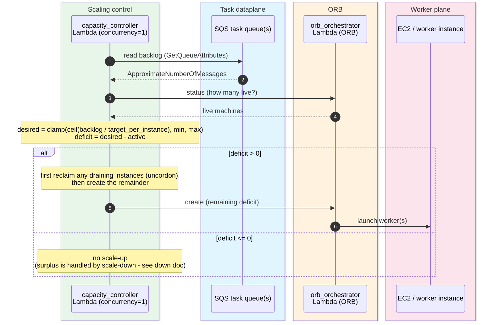
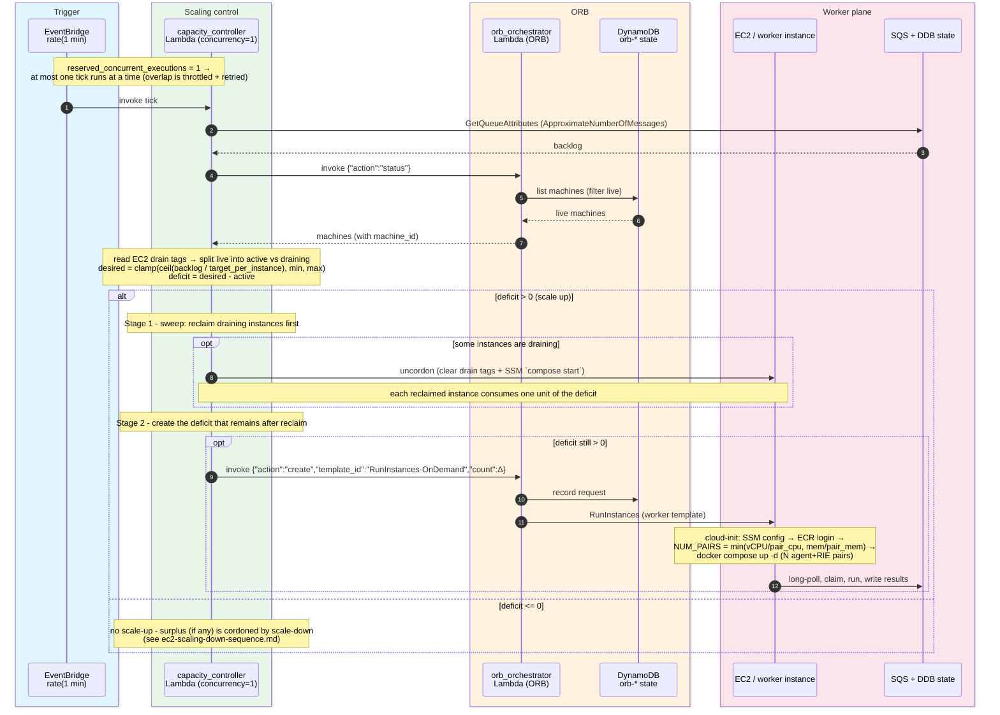

# HTC-Grid EC2 Backend - Scaling-Up Sequence

The control loop for `worker_backend = "ec2"`: every `rate(1 minute)` the capacity
controller reconciles demand (SQS backlog) against supply (ORB live machine count) and
drives ORB to **add** worker instances. This is the EC2 analogue of KEDA + Cluster
Autoscaler on the EKS backend.

This doc covers **scale-up** (reclaim draining instances, then `create`). Graceful,
task-aware **scale-down** has its own document -
[`ec2-scaling-down-sequence.md`](ec2-scaling-down-sequence.md).

## High-level (the core loop)

The essential decision loop: read backlog, read live capacity, compute the deficit, create
workers.

## Detailed

Same loop with the trigger, ORB state store, worker boot, and task dataplane shown.

## Notes

- **Backlog read directly from SQS (no CloudWatch hop).** The controller reads the demand
  signal straight from the task queue - `queue_manager(...).get_queue_length()`, i.e. SQS
  `ApproximateNumberOfMessages` (summed across all priority queues for PrioritySQS,
  `_read_backlog`). This is the *same* number the EKS-only `scaling_metrics` Lambda
  republishes to CloudWatch as `pending_tasks_ddb`; reading the queue directly drops a Lambda
  and a CloudWatch round-trip from the EC2 scaling path, so backlog changes are seen within
  one tick instead of stacking two ~1-min schedules plus CloudWatch ingestion lag.
  `scaling_metrics` / `pending_tasks_ddb` remain **EKS-only** (KEDA consumes the metric
  there); they are not deployed on the ec2 backend.
- **Demand vs supply.** The SQS backlog is the demand signal; ORB's live machine count is
  supply. The controller reconciles to
  `desired = clamp(ceil(backlog / target_pending_per_instance), min, max)` and computes
  `deficit = desired - active`, where `active` is live machines that are **not** draining.
- **Reclaim before launch.** Scale-up has two stages. The sweep stage first **uncordons**
  draining instances (clear the `htc:lifecycle`/`htc:drain_deadline` tags + SSM
  `docker compose start`) up to the size of the deficit, reclaiming capacity that was on its
  way out instead of launching new instances; only the deficit that remains is sent to ORB
  `create`. So a backlog rebound during a drain is absorbed by reclaim, not by new launches.
- **Single-flight via `reserved_concurrent_executions = 1`** (ADR-001). At most one tick runs
  at a time, so overlapping/duplicate invocations cannot double-issue ORB's non-idempotent
  `create`. An overlapping scheduled tick is throttled and async-retried (deferred re-run)
  rather than skipped; concurrency frees on exit (no stuck state). See
  `docs/architecture_design_decisions.md`.
- **Eventually consistent.** `create` returns before instances exist; the next tick sees them
  via `status`, so the loop self-corrects rather than over-launching.
- **Two scaling levels.** ORB scales the number of instances; each instance computes its own
  pair count (`NUM_PAIRS`) at boot. Per-instance worker count is static. (Note: `desired`
  currently assumes one worker per instance - `desired = ceil(backlog / target_per_instance)`
  - which under-counts capacity when `NUM_PAIRS > 1`; see the `TODO` at
  `ec2_capacity_controller.py:219`.)
- **The controller owns drain, not ORB (ADR-005).** The cordon/uncordon/sweep actions are
  EC2-level and issued by the controller directly (`drain.py`: boto3 `CreateTags`/`DeleteTags`
  + SSM `compose stop`/`start`). ORB is invoked only for capacity bookkeeping -
  `status` / `create` / `terminate` (`orb_client.py`). ORB owns the AWS API choice
  (RunInstances / EC2Fleet / ASG).
- **Deferred (v1).** On-demand RunInstances only (EC2 Fleet/Spot is a later phase).
